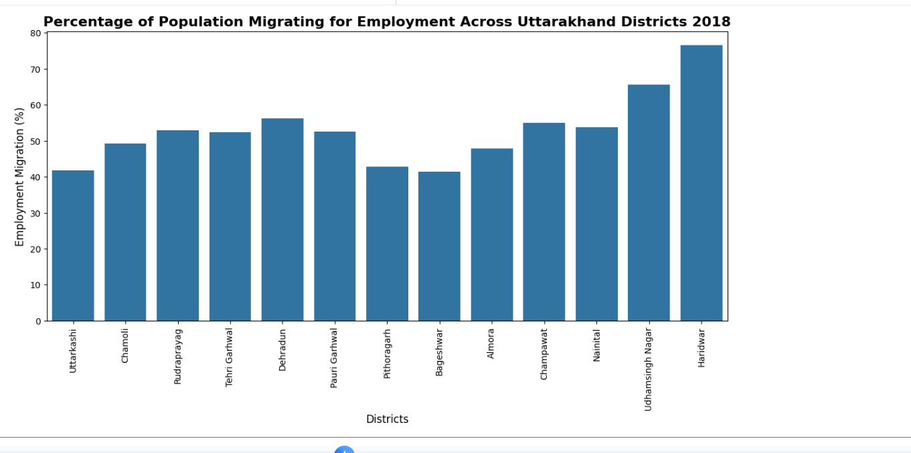
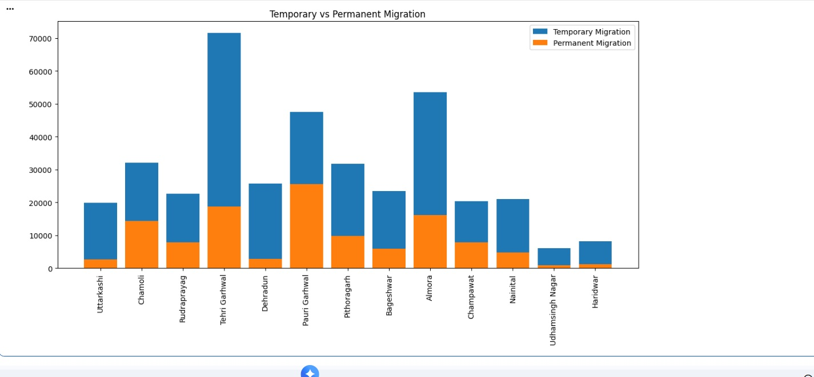
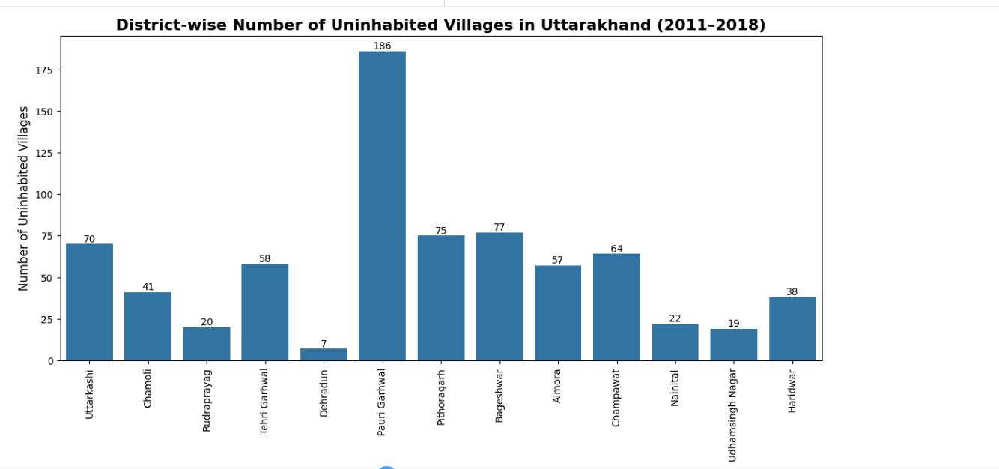
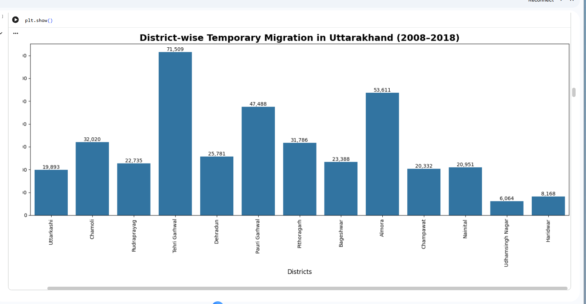
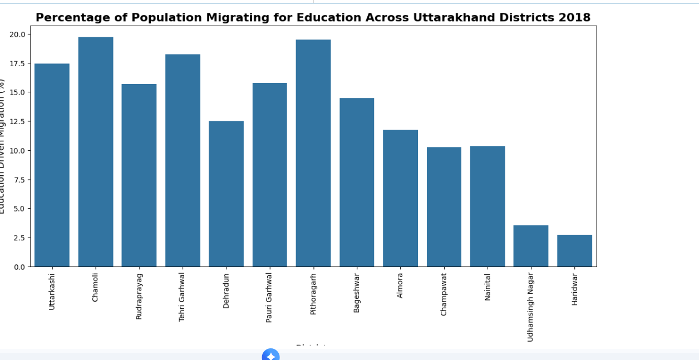
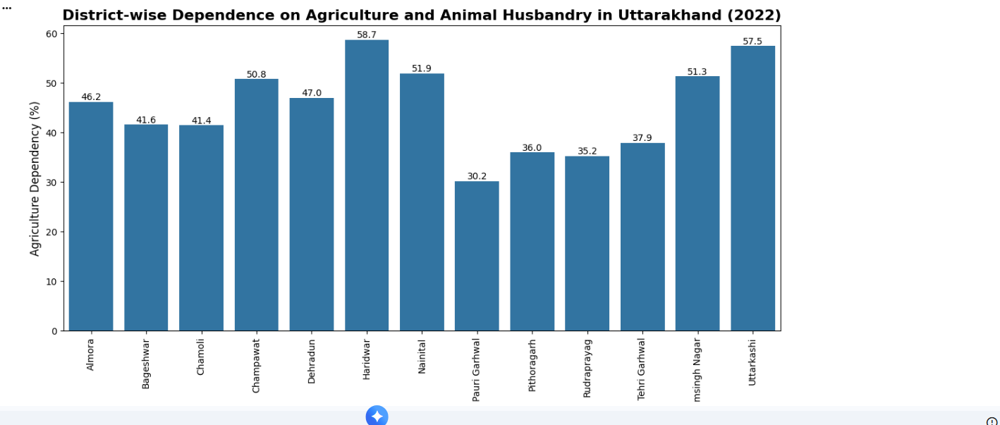
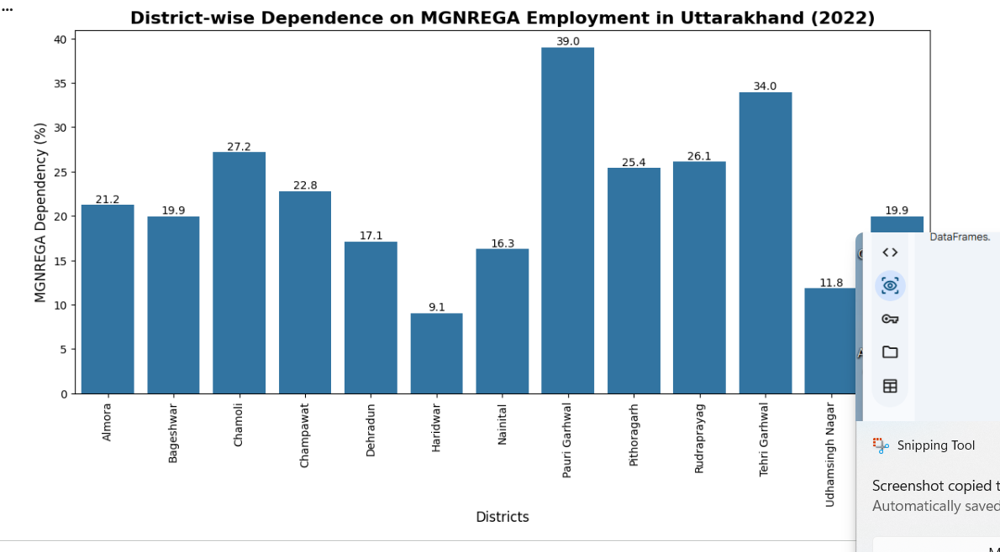

# Uttarakhand Migration Analysis Project

## Overview
This project analyzes migration (Palayan) trends in Uttarakhand using Python, OCR, and data visualization techniques.

The goal of this project is to extract insights from migration-related data and understand district-wise migration patterns.

---

## Features
✅ Hindi OCR Data Extraction  
✅ Data Cleaning using Pandas  
✅ Migration Trend Analysis  
✅ Charts & Visualizations  
✅ District-wise Insights  
✅ Jupyter Notebook Analysis  

---

## Technologies Used
- Python
- Pandas
- Matplotlib
- NumPy
- Jupyter Notebook
- Tesseract OCR

---

# Project Visuals

## Employment Migration Percentage

### Key Insights
- Haridwar and Udhamsingh Nagar show the highest employment migration percentages.
- Mountain districts like Uttarkashi and Bageshwar show lower migration percentages.
- Employment opportunities strongly influence migration patterns across Uttarakhand.
## Temporary vs Permanent Migration

## District-wise Uninhabited Villages Analysis
### Key Insights
- Tehri Garhwal shows the highest temporary migration among all districts.
- Pauri Garhwal has a comparatively high permanent migration rate.
- Urban districts such as Haridwar and Udhamsingh Nagar show lower migration compared to hill districts.
- Temporary migration is significantly higher than permanent migration across most districts.

## Rural Migration Insights

- Pauri Garhwal has the highest number of uninhabited villages.
- Hill districts show stronger migration impact compared to urban districts.
- Migration is contributing to rural depopulation across Uttarakhand.
## District-wise Temporary Migration

## Education-Based Migration Percentage

## Educational Migration Insights

- Chamoli and Pithoragarh show high education-driven migration.
- Haridwar and Udhamsingh Nagar have lower education migration percentages.
- Lack of higher education infrastructure in hill districts may contribute to migration trends.
## Agriculture Dependency Insights
## Agriculture & Animal Husbandry Dependency Analysis

- Haridwar and Uttarkashi show high dependence on agriculture and animal husbandry.
- Pauri Garhwal shows relatively lower dependency compared to other hill districts.
- Economic dependency on agriculture may influence migration and employment trends.

- ## Dependence on MGNREGA Employment

### Key Insights
- Pauri Garhwal shows the highest dependence on MGNREGA employment.
- Tehri Garhwal and Chamoli also demonstrate strong reliance on MGNREGA schemes.
- Haridwar and Udhamsingh Nagar have comparatively lower dependence on MGNREGA employment.
- Rural hill districts rely more on government employment support programs.
